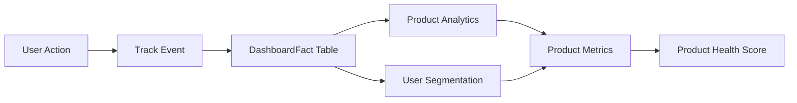

# Analytics Services

**Directory**: `app/services/analytics/`  
**Purpose**: Product analytics, user segmentation, and metrics  
**Owner**: Product Agent

---

## Overview

This directory contains services for product analytics and user insights:

1. **Product Analytics** (`product-analytics.ts`) - Track feature usage and generate insights
2. **User Segmentation** (`user-segmentation.ts`) - Segment users by behavior
3. **Product Metrics** (`product-metrics.ts`) - Aggregate metrics for dashboard

These services power the Product Analytics tile and enable data-driven product decisions.

---

## Product Analytics Service

**File**: `product-analytics.ts`  
**Class**: `ProductAnalyticsService`  
**Spec**: Direction v6.0 (PRODUCT-011)

### Features

- **Feature Adoption Tracking**: % users using each feature
- **Tile Engagement**: Click rates, time to click, modal open rates
- **Modal Action Analysis**: Approve/reject rates by modal type
- **Settings Change Tracking**: Most-changed settings
- **Insight Generation**: Automated recommendations

### Usage

```typescript
import { productAnalyticsService } from "~/services/analytics/product-analytics";

// Track feature usage
await productAnalyticsService.trackFeatureUsage({
  userId: "shop.myshopify.com",
  featureName: "dark_mode",
  action: "enabled",
  timestamp: new Date(),
});

// Get feature adoption metrics (last 30 days)
const startDate = new Date(Date.now() - 30 * 24 * 60 * 60 * 1000);
const endDate = new Date();
const adoption = await productAnalyticsService.getFeatureAdoptionMetrics(
  startDate,
  endDate,
);

console.log(`Dark Mode adoption: ${adoption[0].adoptionRate * 100}%`);

// Get top features
const topFeatures = await productAnalyticsService.getTopFeatures(5);
console.log(
  "Top 5 features:",
  topFeatures.map((f) => f.featureName),
);

// Get unused features
const unused = await productAnalyticsService.getUnusedFeatures(0.1);
console.log(
  "Low adoption features:",
  unused.map((f) => f.featureName),
);

// Generate insights
const insights = await productAnalyticsService.generateInsights(
  startDate,
  endDate,
);
insights.forEach((i) => {
  console.log(`[${i.type}] ${i.message}`);
  console.log(`Recommendation: ${i.recommendation}`);
});
```

### Methods

| Method                                     | Purpose                   | Returns                             |
| ------------------------------------------ | ------------------------- | ----------------------------------- |
| `trackFeatureUsage(event)`                 | Record feature usage      | `Promise<void>`                     |
| `getFeatureAdoptionMetrics(start, end)`    | Feature adoption rates    | `Promise<FeatureAdoptionMetrics[]>` |
| `getTileEngagementMetrics(start, end)`     | Tile click/view rates     | `Promise<TileEngagementMetrics[]>`  |
| `getModalActionMetrics(start, end)`        | Approve/reject rates      | `Promise<ModalActionMetrics[]>`     |
| `getSettingsChangeMetrics(start, end)`     | Settings change frequency | `Promise<SettingsChangeMetrics[]>`  |
| `getTopFeatures(limit, start, end)`        | Most-used features        | `Promise<FeatureAdoptionMetrics[]>` |
| `getUnusedFeatures(threshold, start, end)` | Low-adoption features     | `Promise<FeatureAdoptionMetrics[]>` |
| `generateInsights(start, end)`             | Automated recommendations | `Promise<Insight[]>`                |

---

## User Segmentation Service

**File**: `user-segmentation.ts`  
**Class**: `UserSegmentationService`  
**Spec**: Direction v6.0 (PRODUCT-012)

### Segment Types

| Segment     | Criteria                        | Engagement Score | Characteristics                           |
| ----------- | ------------------------------- | ---------------- | ----------------------------------------- |
| **Power**   | Daily usage, score ≥70          | 70-100           | High feature adoption, frequent approvals |
| **Casual**  | Weekly usage, score 40-69       | 40-69            | Moderate usage, standard patterns         |
| **New**     | Signup <7 days ago              | Varies           | Exploring features, learning              |
| **Churned** | No activity 30+ days, score <40 | 0-39             | At risk, needs re-engagement              |

### Engagement Scoring Model

**Formula**: Weighted sum of 4 factors (total: 100 points)

1. **Recency** (30 points): Days since last active (lower = higher score)
2. **Frequency** (30 points): Sessions per week (more = higher score)
3. **Depth** (20 points): Features used per session (more = higher score)
4. **Value** (20 points): Approvals made (more = higher score)

### Usage

```typescript
import { userSegmentationService } from "~/services/analytics/user-segmentation";

// Calculate engagement score
const score = await userSegmentationService.calculateEngagementScore(
  "shop.myshopify.com",
  30, // lookback days
);
console.log(`Engagement score: ${score}/100`);

// Segment user
const segment = await userSegmentationService.segmentUser("shop.myshopify.com");
console.log(`User segment: ${segment}`);

// Get detailed segment data
const segmentData =
  await userSegmentationService.getUserSegmentData("shop.myshopify.com");
console.log({
  segment: segmentData.segment,
  engagementScore: segmentData.engagementScore,
  totalSessions: segmentData.totalSessions,
  featuresUsed: segmentData.featuresUsed,
  approvalCount: segmentData.approvalCount,
});

// Get all segment analytics
const analytics = await userSegmentationService.getSegmentAnalytics();
analytics.forEach((s) => {
  console.log(`${s.segment}: ${s.userCount} users (${s.percentage * 100}%)`);
  console.log(`  Avg score: ${s.avgEngagementScore}`);
  console.log(`  Recommendations:`, s.recommendations);
});
```

### Methods

| Method                                   | Purpose               | Returns                       |
| ---------------------------------------- | --------------------- | ----------------------------- |
| `calculateEngagementScore(userId, days)` | Calculate 0-100 score | `Promise<number>`             |
| `segmentUser(userId)`                    | Determine segment     | `Promise<UserSegment>`        |
| `getUserSegmentData(userId)`             | Complete segment data | `Promise<UserSegmentData>`    |
| `getSegmentAnalytics()`                  | Aggregate by segment  | `Promise<SegmentAnalytics[]>` |

---

## Product Metrics Service

**File**: `product-metrics.ts`  
**Class**: `ProductMetricsService`  
**Spec**: Direction v6.0 (PRODUCT-013)

### Features

- **DAU/WAU/MAU Calculation**: Daily/Weekly/Monthly Active Users
- **Product Health Score**: 0-100 composite score
- **Trend Data**: DAU over time
- **Health Interpretation**: Excellent/Good/Fair/Poor status

### Health Score Formula

**Total**: 100 points (4 factors)

1. **User Retention** (30 points): DAU/MAU ratio (stickiness)
2. **Feature Adoption** (25 points): % features with >10% adoption
3. **User Engagement** (25 points): Average engagement score
4. **Approval Quality** (20 points): Approval rate

**Interpretation**:

- 80-100: Excellent (green) - Product thriving
- 60-79: Good (blue) - Product performing well
- 40-59: Fair (yellow) - Product needs attention
- 0-39: Poor (red) - Product requires immediate action

### Usage

```typescript
import { productMetricsService } from "~/services/analytics/product-metrics";

// Get all metrics
const metrics = await productMetricsService.getProductMetrics();
console.log({
  dau: metrics.dau,
  mau: metrics.mau,
  dauMauRatio: metrics.dauMauRatio,
  healthScore: metrics.productHealthScore,
});

// Get specific metrics
const dau = await productMetricsService.calculateDAU();
const mau = await productMetricsService.calculateMAU();
console.log(
  `DAU: ${dau}, MAU: ${mau}, Stickiness: ${((dau / mau) * 100).toFixed(0)}%`,
);

// Get health score
const { score, factors } =
  await productMetricsService.calculateProductHealthScore();
const interpretation = productMetricsService.getHealthInterpretation(score);
console.log(`Health: ${score}/100 (${interpretation.status})`);
console.log(`Message: ${interpretation.message}`);

// Get DAU trend (last 30 days)
const trend = await productMetricsService.getDAUTrend(30);
trend.forEach((d) => console.log(`${d.date}: ${d.value} users`));
```

### Methods

| Method                           | Purpose              | Returns                     |
| -------------------------------- | -------------------- | --------------------------- |
| `calculateDAU(date)`             | Daily active users   | `Promise<number>`           |
| `calculateWAU(endDate)`          | Weekly active users  | `Promise<number>`           |
| `calculateMAU(endDate)`          | Monthly active users | `Promise<number>`           |
| `calculateProductHealthScore()`  | 0-100 health score   | `Promise<{score, factors}>` |
| `getProductMetrics()`            | All metrics          | `Promise<ProductMetrics>`   |
| `getDAUTrend(days)`              | DAU over time        | `Promise<TrendData[]>`      |
| `getHealthInterpretation(score)` | Status message       | `{status, message, color}`  |

---

## Data Flow



---

## Integration Examples

### Dashboard Tile

```typescript
// app/routes/app._index.tsx

import { productMetricsService } from "~/services/analytics/product-metrics";

export async function loader({ request }: Route.LoaderArgs) {
  const metrics = await productMetricsService.getProductMetrics();

  return {
    productHealth: {
      score: metrics.productHealthScore,
      dau: metrics.dau,
      mau: metrics.mau,
      stickiness: metrics.dauMauRatio,
    },
  };
}
```

### Feature Flag Check

```typescript
// app/routes/settings.tsx

import { featureFlagService } from "~/services/experiments/feature-flags";

export async function loader({ request }: Route.LoaderArgs) {
  const shop = await getShop(request);

  const darkModeEnabled = await featureFlagService.isFeatureEnabled(
    "FEATURE_DARK_MODE",
    shop,
  );

  return { darkModeEnabled };
}
```

### A/B Test in Component

```typescript
// app/components/Dashboard.tsx

import { abTestingService } from "~/services/experiments/ab-testing";

export function Dashboard({ experiment }: { experiment: Experiment }) {
  const shop = useShop();

  // Assign variant on mount
  useEffect(() => {
    const assignment = abTestingService.assignVariant(shop, experiment);
    setVariant(assignment.variantId);

    // Track exposure
    abTestingService.trackExposure(experiment.id, assignment.variantId, shop);
  }, []);

  // Track conversion on click
  const handleTileClick = async () => {
    await abTestingService.trackConversion(
      experiment.id,
      variant,
      shop,
      "tile_clicked",
      1
    );
  };

  // Render based on variant
  return variant === "control" ? <ControlLayout /> : <VariantLayout />;
}
```

---

## Performance Considerations

- **Caching**: Feature flag checks should be cached (TTL: 60s)
- **Batch Tracking**: Track events in batches (don't await on every event)
- **Index Optimization**: DashboardFact should have indexes on `category`, `shop`, `timestamp`
- **Aggregation Limits**: Limit `getFeatureAdoptionMetrics()` to 30-90 days max

---

## Future Enhancements

1. **Real-Time Dashboards**: Live DAU/MAU updates via SSE
2. **Cohort Analysis**: Track user cohorts over time
3. **Funnel Analysis**: Multi-step conversion funnels
4. **Attribution**: Which features drive engagement?
5. **Predictive Models**: Churn prediction, LTV estimation

---

**Last Updated**: 2025-10-21  
**Questions**: Contact Product agent in `feedback/product/2025-10-21.md`
