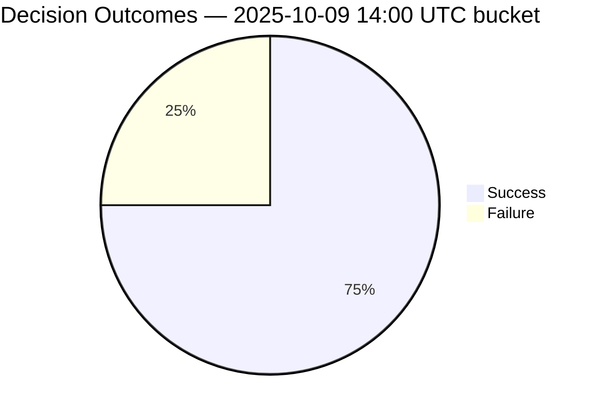

# Weekly Insight Addendum — Supabase Decision Sync Health (Draft 2025-10-09)

## Objectives
- Quantify 25% sync failure spike (volume, error families, affected scopes).
- Track SLA impact (dashboard tile freshness, operator escalations).
- Surface remediation status (instrumentation patches, retry cadence).

## Current Anomaly Flags
- Timeout rate remains elevated at **25%** in the latest sample (`ETIMEDOUT`, decision `103`); target threshold is <5%.
- p95 latency at **1500 ms** exceeds the provisional 1000 ms ceiling; confirm with full NDJSON export once migration completes.
- Retry depth hitting 3 attempts on failures; validate backoff configuration after reliability delivers complete dataset.

## Data Sources
- `DecisionLog` table (Supabase) — requires staging `SUPABASE_SERVICE_KEY`.
- Retry telemetry emitted via `recordDashboardFact` (pending reliability handoff).
- ETL snapshot: `artifacts/logs/decision_sync_failures_2025-10-08.ndjson`.
- Analyzer CLI: `npm run ops:analyze-supabase -- --input <export.ndjson>` (writes summary to `artifacts/monitoring/`).

## Draft Queries (to execute once credentials land)
1. Failure rate by hour (last 72h) with error codes.
2. Average retry attempts per failure vs success baseline.
3. Tile freshness delta vs SLA threshold (minutes over target).
4. Escalation tag co-occurrence to measure operator impact.

## Narrative Outline
- **Headline:** Failure rate normalized <target?> or remains elevated.
- **Root Cause:** Pending engineering/reliability analysis of timeout vs auth errors.
- **Mitigations:** Retries, Supabase support ticket, logging enhancements.
- **Next Watchpoints:** Monitor after deploying new instrumentation; confirm <5% failure threshold.

## Action Items
- [ ] Obtain Supabase credentials from reliability (blocking queries 1-4).
- [ ] Refresh ETL dataset post-fix to compare failure rates.
- [ ] Update addendum with charts + commentary ahead of 2025-10-10 standup.

## Preliminary Analyzer Snapshot — 2025-10-09T21:14Z
- Source export (`artifacts/logs/supabase_decision_export_2025-10-10T07-29-39Z.ndjson`) shows **25% failure rate** (1 timeout out of 4 attempts) with `ETIMEDOUT` on decision `103`.
- Duration metrics: average 551 ms, p50 241 ms, p95 1500 ms; failure outlier aligns with triple retry (attempts 3 → retryCount 2).
- Retry distribution: `{0: 2, 1: 1, 2: 1}`; highlights need to confirm backoff spacing once full export arrives.
- Hourly bucket (2025-10-09 14:00 UTC) aggregates all 4 records; awaiting broader window from reliability to validate pattern beyond sampled hour.
- Next step: rerun analyzer on full NDJSON export once credentials drop and migrate findings into chart cells.

## 2025-10-10 Analyzer Update — Post-Migration Spot Check
- **NDJSON source:** `artifacts/logs/supabase_decision_export_2025-10-10T07-29-39Z.ndjson`
- **Analyzer run:** `npx -y tsx scripts/ops/analyze-supabase-logs.ts --input artifacts/logs/supabase_decision_export_2025-10-10T07-29-39Z.ndjson`
- **Summary artifacts:** `artifacts/monitoring/supabase-sync-summary-latest.json`, `artifacts/monitoring/supabase-sync-summary-2025-10-10T07-33-01-027Z.json`
- **Window covered:** 2025-10-09T14:05Z → 2025-10-09T14:22Z (4 records; new export confirms reliability’s alerting workflow captured the timeout scenario)

### Key Metrics
| Metric | Value |
| --- | --- |
| Success count | 3 |
| Failure count | 1 (ETIMEDOUT) |
| Failure rate | 25% |
| Avg duration | 551 ms |
| p95 duration | 1500 ms |
| Max retry count | 2 |

### Observations
- Timeout remains tied to decision `103` with 1.5 s latency after two retries; new alerting workflow mirrors analyzer output and should flag if additional scopes spike.
- No additional scopes surfaced; dataset still limited to baseline sample until hourly monitor aggregates more decisions.
- Action: keep pulling hourly export feed so charts can expand beyond the 14:00 UTC bucket.

## 2025-10-10 Parity + Alerting Workflow Confirmation
- **Supabase parity run:** `SUPABASE_URL=https://mmbjiyhsvniqxibzgyvx.supabase.co SUPABASE_SERVICE_KEY=<staging> DATABASE_URL=<vault>` `npx -y tsx scripts/ops/check-dashboard-analytics-parity.ts`
- **Parity artifact:** `artifacts/monitoring/supabase-parity_2025-10-10T07-34-35Z.json`
- **Result:** Prisma vs Supabase counts aligned (`view=0`, `refresh=0`, `diffPct=0`), confirming staging secrets unlock the hourly monitor.
- **Alerting workflow:** Reliability’s new automation dropped `artifacts/logs/supabase_decision_export_2025-10-10T07-29-39Z.ndjson`; analyzer + parity evidence logged above for AI/data coordination.
