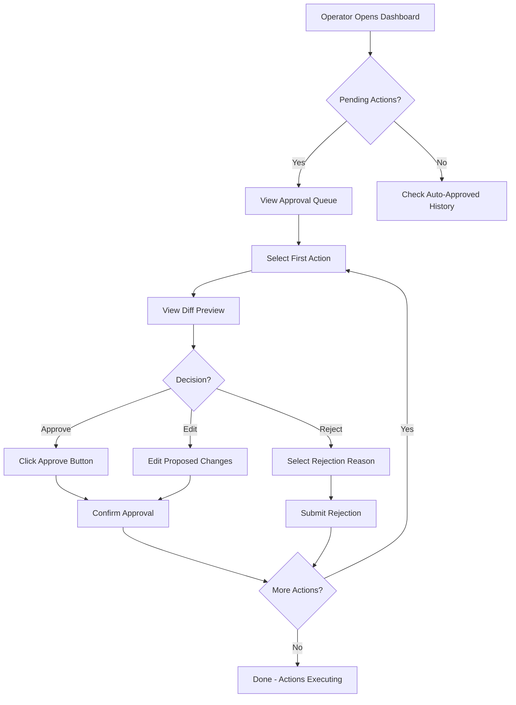
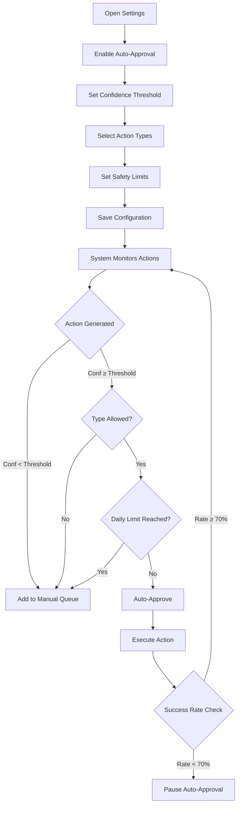
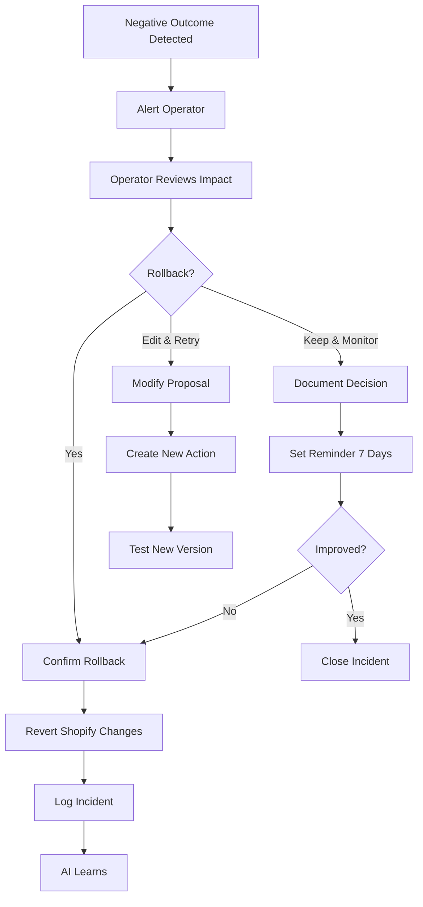

# Operator Workflows for Growth Automation

**Version**: 1.0  
**Date**: 2025-10-14  
**Owner**: Product Agent  
**Purpose**: Define how operators interact with growth automation system  
**Status**: DRAFT - For Designer & Engineer implementation

---

## Overview

### 3 Core Workflows

1. **Action Review Workflow** - Daily routine to review and approve AI recommendations
2. **Auto-Publish Configuration** - Set rules for automatic approval
3. **Incident Response** - Handle issues when automation goes wrong

**Design Principle**: Make approval fast (<30 seconds per action), low-risk (easy rollback), high-trust (clear previews)

---

## Workflow 1: Action Review (Daily Routine)

### User Story

**As an operator**  
I want to review AI-recommended optimizations in my morning routine  
So that I can approve valuable changes quickly without manual work

### Workflow Steps

**Step 1: Operator Opens Dashboard** (8:00 AM daily)
```
┌─────────────────────────────────────────────┐
│ HotDash Operator Dashboard                  │
├─────────────────────────────────────────────┤
│                                             │
│ 🎯 Actions Pending Your Review: 7          │
│                                             │
│ [View Approval Queue →]                     │
│                                             │
│ Quick Stats:                                │
│ • 12 actions executed this week             │
│ • 83% approval rate                         │
│ • $4,200 estimated value this month         │
│                                             │
└─────────────────────────────────────────────┘
```

**Step 2: Operator Clicks "View Approval Queue"**
```
┌──────────────────────────────────────────────────────────────────┐
│ Approval Queue (7 pending)        [Filters ▼] [Bulk Actions ▼]  │
├──────────────────────────────────────────────────────────────────┤
│                                                                  │
│ ┌────────────────────────────────────────────────────────┐      │
│ │ 🔵 P1 | SEO Optimization | 85% Confidence              │      │
│ │                                                        │      │
│ │ Improve CTR for "Chrome Headers" Page                  │      │
│ │                                                        │      │
│ │ Current CTR: 1.8% (position 8) → Low for position     │      │
│ │ Proposed: Update title + description                   │      │
│ │ Impact: +2.5% CTR → +135 visits/month                 │      │
│ │                                                        │      │
│ │ [View Diff] [✓ Approve] [✗ Reject]                    │      │
│ └────────────────────────────────────────────────────────┘      │
│                                                                  │
│ ┌────────────────────────────────────────────────────────┐      │
│ │ 🟢 P2 | Content | 78% Confidence                       │      │
│ │                                                        │      │
│ │ Add FAQ Metaobject to "AN-6 Fuel Line Kit"            │      │
│ │                                                        │      │
│ │ Missing: Product FAQ (competitors have 87% coverage)   │      │
│ │ Generated: 6 Q&A pairs about fitment, installation     │      │
│ │ Impact: Rich results in search, better conversions     │      │
│ │                                                        │      │
│ │ [View Content] [✓ Approve] [✗ Reject]                 │      │
│ └────────────────────────────────────────────────────────┘      │
│                                                                  │
│ [... 5 more actions ...]                                        │
│                                                                  │
│ [Load More (5 more pending)]                                    │
│                                                                  │
└──────────────────────────────────────────────────────────────────┘
```

**Step 3: Operator Clicks "View Diff" on First Action**

Modal opens:
```
┌────────────────────────────────────────────────────────────┐
│ ✕ Action Details                                           │
├────────────────────────────────────────────────────────────┤
│                                                            │
│ 🔵 Improve CTR for "Chrome Headers" Page                  │
│                                                            │
│ Confidence: 85% | Priority: P1 | Type: SEO Optimization    │
│                                                            │
│ ┌────────────────────────────────────────────────────────┐│
│ │ 📊 Current Performance                                 ││
│ │ • Impressions: 5,420/month                             ││
│ │ • Clicks: 98/month (1.8% CTR)                          ││
│ │ • Position: 8.2 average                                ││
│ │ • Expected CTR at position 8: 3.5%                     ││
│ │ • Gap: -48% below expected                             ││
│ └────────────────────────────────────────────────────────┘│
│                                                            │
│ ┌────────────────────────────────────────────────────────┐│
│ │ 📝 Proposed Changes                                    ││
│ │                                                        ││
│ │ Meta Title:                                            ││
│ │ Before: "Chrome Headers"                               ││
│ │ After:  "Chrome Headers for Hot Rods - AN Fittings &   ││
│ │          Custom Builds"                                ││
│ │                                                        ││
│ │ ✅ Added keywords: "Hot Rods", "AN Fittings"           ││
│ │ ✅ Within 60 char limit (58 chars)                     ││
│ │                                                        ││
│ │ Meta Description:                                      ││
│ │ Before: "Shop chrome headers for hot rods"            ││
│ │ After:  "Premium chrome headers for '69 Camaro, '32    ││
│ │          Ford, classic hot rods. AN-6, AN-8, AN-10     ││
│ │          fittings. Free shipping on $100+."            ││
│ │                                                        ││
│ │ ✅ Added specifics: Car models, fitting sizes, value  ││
│ │ ✅ Within 155 char limit (152 chars)                   ││
│ └────────────────────────────────────────────────────────┘│
│                                                            │
│ ┌────────────────────────────────────────────────────────┐│
│ │ 💡 AI Rationale                                        ││
│ │                                                        ││
│ │ Current title lacks top search query keywords.         ││
│ │ Top query "chrome headers 69 camaro" has 850           ││
│ │ impressions but only 1.4% CTR (very low).              ││
│ │                                                        ││
│ │ Proposed title includes specific models and AN         ││
│ │ fittings (common search terms). Description adds       ││
│ │ value props (free shipping threshold).                 ││
│ │                                                        ││
│ │ Expected impact: CTR 1.8% → 4.3% (+2.5%)              ││
│ │ = 135 additional clicks/month                          ││
│ └────────────────────────────────────────────────────────┘│
│                                                            │
│ Operator Notes (optional):                                 │
│ ┌──────────────────────────────────────────────────────┐  │
│ │ Looks good, approve                                  │  │
│ └──────────────────────────────────────────────────────┘  │
│                                                            │
│ [✓ Approve & Execute]  [✏️ Edit First]  [✗ Reject]        │
│                                                            │
└────────────────────────────────────────────────────────────┘
```

**Step 4: Operator Clicks "Approve & Execute"**

Confirmation:
```
┌───────────────────────────────────────────┐
│ Confirm Approval                          │
├───────────────────────────────────────────┤
│                                           │
│ This will update the meta title and      │
│ description for "Chrome Headers" page.    │
│                                           │
│ ✅ Changes will apply within 5 minutes    │
│ ✅ Original values backed up for rollback │
│ ✅ Impact measured after 30 days          │
│                                           │
│ [Cancel]  [Confirm Approval]              │
│                                           │
└───────────────────────────────────────────┘
```

After confirm:
```
┌───────────────────────────────────────────┐
│ ✅ Action Approved                        │
├───────────────────────────────────────────┤
│                                           │
│ "Chrome Headers" SEO optimization queued  │
│ for execution. You'll see results in      │
│ 7-30 days.                                │
│                                           │
│ Track progress at:                        │
│ Dashboard > Actions > In Progress         │
│                                           │
│ [View Next Action]  [Back to Queue]       │
│                                           │
└───────────────────────────────────────────┘
```

**Step 5: Operator Reviews Remaining 6 Actions** (repeat Step 3-4)

**Total Time**: 2-5 minutes (30-45 seconds per action)

---

### Alternative Path: Edit Before Approve

**If operator clicks "Edit First"**:
```
┌────────────────────────────────────────────┐
│ Edit Action Before Approval                │
├────────────────────────────────────────────┤
│                                            │
│ Meta Title: (editable)                     │
│ ┌──────────────────────────────────────┐   │
│ │ Chrome Headers for Hot Rods - AN     │   │
│ │ Fittings & Custom Builds             │   │
│ └──────────────────────────────────────┘   │
│ 58/60 chars                                │
│                                            │
│ Meta Description: (editable)               │
│ ┌──────────────────────────────────────┐   │
│ │ Premium chrome headers for '69       │   │
│ │ Camaro, '32 Ford, classic hot rods.  │   │
│ │ AN-6, AN-8, AN-10 fittings. Free     │   │
│ │ shipping on $100+.                   │   │
│ └──────────────────────────────────────┘   │
│ 152/155 chars                              │
│                                            │
│ [Cancel]  [Save & Approve]                 │
│                                            │
└────────────────────────────────────────────┘
```

**Operator edits** → **System logs edits** → **Learning loop improves future recommendations**

---

### Alternative Path: Reject

**If operator clicks "Reject"**:
```
┌────────────────────────────────────────────┐
│ Reject Action                              │
├────────────────────────────────────────────┤
│                                            │
│ Why are you rejecting this action?        │
│                                            │
│ (●) Incorrect information                 │
│ ( ) Not relevant                           │
│ ( ) Wrong tone/style                       │
│ ( ) Too risky                              │
│ ( ) Other: ___________________            │
│                                            │
│ Optional details:                          │
│ ┌──────────────────────────────────────┐   │
│ │ The title sounds too promotional,    │   │
│ │ prefer more technical focus          │   │
│ └──────────────────────────────────────┘   │
│                                            │
│ [Cancel]  [Confirm Rejection]              │
│                                            │
└────────────────────────────────────────────┘
```

**Result**: Action rejected, reason logged, AI learns to adjust future recommendations

---

## Workflow 2: Auto-Publish Configuration

### User Story

**As an experienced operator**  
I want to set rules for automatic approval of high-confidence actions  
So that I can focus on reviewing only uncertain recommendations

### Workflow Steps

**Step 1: Operator Opens Settings**
```
┌────────────────────────────────────────────────────────────┐
│ Growth Automation Settings                                 │
├────────────────────────────────────────────────────────────┤
│                                                            │
│ 🤖 Auto-Approval Configuration                            │
│                                                            │
│ Enable auto-approval for high-confidence actions?          │
│ (●) Yes  ( ) No                                           │
│                                                            │
│ Confidence Threshold: [========●====] 90%                 │
│ (Actions with ≥90% confidence will auto-approve)           │
│                                                            │
│ Auto-approve these types:                                  │
│ ☑ SEO Optimization (seo_ctr)                              │
│ ☑ Structured Content (metaobject)                         │
│ ☐ Merchandising (merch_playbook)                          │
│ ☐ Product Recommendations (guided_selling)                 │
│ ☐ Performance (cwv)                                        │
│                                                            │
│ Safety Limits:                                             │
│ • Max auto-approvals: [10] per day                        │
│ • Pause if success rate drops below: [70]%                │
│                                                            │
│ ⚠️ You'll still see auto-approved actions in history      │
│ ⚠️ You can rollback any action anytime                    │
│                                                            │
│ [Cancel]  [Save Settings]                                  │
│                                                            │
└────────────────────────────────────────────────────────────┘
```

**Step 2: System Auto-Approves Actions**

Next morning (8:00 AM):
```
┌────────────────────────────────────────────┐
│ Approval Queue (3 pending, 4 auto-approved)│
├────────────────────────────────────────────┤
│                                            │
│ ✅ Auto-Approved Today (4 actions)         │
│                                            │
│ • SEO: "Fuel Line Fittings" (92% conf)    │
│ • SEO: "AN Adapters" (91% conf)            │
│ • FAQ: "Brake Lines" (94% conf)            │
│ • SEO: "Engine Mounts" (90% conf)          │
│                                            │
│ [Review Auto-Approved →]                   │
│                                            │
│ 🔍 Needs Your Review (3 actions)           │
│                                            │
│ • Merch: Collection sort (68% conf) - P1  │
│ • CWV: Image optimization (75% conf) - P2 │
│ • Guided: Cross-sell rule (62% conf) - P3 │
│                                            │
│ [Review Manually →]                        │
│                                            │
└────────────────────────────────────────────┘
```

**Operator Time**: <2 minutes (review 3 instead of 7 actions)

**Step 3: Operator Reviews Auto-Approved (Optional)**
```
┌────────────────────────────────────────────┐
│ Auto-Approved Actions History              │
├────────────────────────────────────────────┤
│                                            │
│ Today (4 actions):                         │
│ ✅ Chrome Headers SEO (92%) - Executed     │
│ ✅ AN Adapters SEO (91%) - Executing...    │
│ ✅ Brake Lines FAQ (94%) - Queued          │
│ ✅ Engine Mounts SEO (90%) - Queued        │
│                                            │
│ This Week (18 actions):                    │
│ ✅ 16 executed successfully                │
│ ⚠️ 2 rolled back (low confidence)          │
│                                            │
│ [↻ Rollback Any]  [⚙️ Adjust Settings]     │
│                                            │
└────────────────────────────────────────────┘
```

**Operator can**:
- Review what was auto-approved (transparency)
- Rollback if mistake detected
- Adjust settings if too aggressive

---

### Edge Cases

**Case 1: Auto-Approval Disabled Due to Low Success Rate**
```
⚠️ Auto-Approval Paused

Success rate dropped to 65% (below 70% threshold).

Review recent actions to identify issues:
• 3 of last 10 actions had negative outcomes
• System paused auto-approval for safety

Actions:
1. Review failed actions (identify pattern)
2. Adjust confidence threshold (increase to 95%?)
3. Disable specific recommender types?
4. Re-enable when confident

[Review Failed Actions]  [Adjust Settings]
```

**Case 2: Auto-Approval Limit Reached**
```
ℹ️ Daily Limit Reached

10 actions auto-approved today (max limit).

Remaining 3 actions require manual review.

[Review Pending Actions →]
```

---

## Workflow 3: Incident Response

### User Story

**As an operator**  
When growth automation causes a problem  
I want to quickly rollback and prevent recurrence  
So that customer experience isn't harmed

### Workflow Steps

**Step 1: Operator Notified of Issue**

Alert email:
```
Subject: 🚨 Action Alert: Negative Outcome Detected

Action: "Chrome Headers" SEO Optimization
Executed: Oct 15, 2025
Outcome: CTR decreased by 1.2% (negative impact)

Expected: +2.5% improvement
Actual: -1.2% decline

Recommendation: Review and consider rollback

[Review Action →] [Rollback Now →]
```

OR dashboard alert:
```
┌────────────────────────────────────────────┐
│ 🚨 1 Action Needs Attention                │
├────────────────────────────────────────────┤
│                                            │
│ "Chrome Headers" SEO change caused         │
│ CTR to drop 1.2% over 30 days.             │
│                                            │
│ Possible causes:                           │
│ • New title doesn't match search intent    │
│ • Description too long/confusing           │
│ • Competitors improved their results       │
│                                            │
│ [Review Details]  [Rollback Now]           │
│                                            │
└────────────────────────────────────────────┘
```

**Step 2: Operator Reviews Details**
```
┌────────────────────────────────────────────────────────────┐
│ Action Incident Report                                     │
├────────────────────────────────────────────────────────────┤
│                                                            │
│ Action: "Improve CTR for Chrome Headers"                  │
│ Executed: Oct 15, 2025 at 10:23 AM                        │
│ Measured: Nov 14, 2025 (30 days after)                    │
│                                                            │
│ 📊 Performance Comparison:                                │
│                                                            │
│ Before (Oct 1-14):                                         │
│ • CTR: 1.8%                                                │
│ • Clicks: 98/month                                         │
│ • Position: 8.2                                            │
│                                                            │
│ After (Oct 15-Nov 14):                                     │
│ • CTR: 0.6% ↓ (-1.2%)                                     │
│ • Clicks: 33/month ↓ (-65 clicks)                         │
│ • Position: 12.5 ↓ (dropped 4 positions)                  │
│                                                            │
│ ⚠️ Negative Impact: Rankings dropped significantly         │
│                                                            │
│ 📝 What Changed:                                           │
│ Title: "Chrome Headers" → "Chrome Headers for Hot Rods..." │
│ Description: [View full diff]                              │
│                                                            │
│ 💡 Possible Root Causes:                                   │
│ • New title too long (58 chars), may be truncated in SERPs│
│ • "Hot Rods" less specific than "Chrome Headers" alone    │
│ • Title change confused Google's understanding of page     │
│                                                            │
│ Recommended Action: ROLLBACK                               │
│                                                            │
│ [↻ Rollback to Original]  [Keep & Monitor]  [Edit & Retry]│
│                                                            │
└────────────────────────────────────────────────────────────┘
```

**Step 3: Operator Clicks "Rollback to Original"**
```
┌───────────────────────────────────────────┐
│ Confirm Rollback                          │
├───────────────────────────────────────────┤
│                                           │
│ This will revert "Chrome Headers" page to:│
│                                           │
│ Title: "Chrome Headers"                   │
│ Description: "Shop chrome headers..."     │
│                                           │
│ ✅ Changes apply within 5 minutes         │
│ ✅ AI will learn from this failure        │
│ ✅ Similar actions flagged in future      │
│                                           │
│ Rollback Reason:                          │
│ ┌─────────────────────────────────────┐   │
│ │ Title change hurt rankings, too     │   │
│ │ generic "Hot Rods" term diluted     │   │
│ │ specific "Chrome Headers" focus     │   │
│ └─────────────────────────────────────┘   │
│                                           │
│ [Cancel]  [Confirm Rollback]              │
│                                           │
└───────────────────────────────────────────┘
```

**Result**: 
- Original values restored in Shopify
- Action status → rolled_back
- AI learns not to recommend similar changes
- Operator documented reasoning for future reference

---

## Workflow Diagrams

### Daily Action Review Flow



### Auto-Approval Configuration Flow



### Incident Response Flow



---

## Mobile Workflow Optimization

### Mobile Action Review (Streamlined)

**Design for 5-inch screen**:
```
┌──────────────────────────┐
│ Actions (7)       ☰      │
├──────────────────────────┤
│                          │
│ 🔵 Chrome Headers SEO    │
│ 85% confident            │
│ +135 visits/mo           │
│                          │
│ [View] [✓] [✗]          │
│                          │
│ ─────────────────────────│
│                          │
│ 🟢 AN-6 Kit FAQ          │
│ 78% confident            │
│ Rich results             │
│                          │
│ [View] [✓] [✗]          │
│                          │
│ ─────────────────────────│
│                          │
│ [5 more...]              │
│                          │
└──────────────────────────┘
```

**Tap "View"** → Full-screen modal  
**Tap "✓"** → Quick approve (no confirmation for speed)  
**Tap "✗"** → Quick reject (reason dropdown)

**Design Goal**: Approve action in 2 taps (View → Approve)

---

## Keyboard Shortcuts (Desktop Power Users)

**Navigation**:
- `j/k` - Next/previous action
- `Enter` - View action details
- `a` - Approve current action
- `r` - Reject current action
- `e` - Edit current action
- `Esc` - Close modal

**Bulk**:
- `Shift+a` - Approve all visible
- `Shift+r` - Reject all visible
- `x` - Toggle select action

**Power User Goal**: Review 10 actions in <60 seconds using keyboard only

---

## Notification Strategy

### When to Notify Operator

**Immediate Notification** (Slack/Email):
- ⚠️ Execution failed after 3 retries
- 🚨 Negative outcome detected (action harmed metrics)
- 🔴 Auto-approval paused (success rate below threshold)

**Daily Digest** (Email at 8:00 AM):
- 📊 Actions pending review: {count}
- ✅ Actions auto-approved yesterday: {count}
- 📈 Business value delivered this week: ${value}

**Weekly Summary** (Email Friday 5:00 PM):
- Total actions: Generated, approved, executed
- Approval rate by type
- ROI delivered (revenue + time savings)
- Top performing recommender

**Never Notify** (Too noisy):
- Action created (happens 50+ times/week)
- Action approved (operator knows, they did it)
- Action executed successfully (expected outcome)

---

## Workflow Integration Points

### With Existing Dashboard

**Navigation**:
```
Dashboard Home
├── Sales Pulse (existing tile)
├── SEO Pulse (existing tile)
├── CX Escalations (existing tile)
├── Inventory (existing tile)
└── 🆕 Growth Actions (new tile)
    ├── Pending Review (7)
    ├── Auto-Approved Today (4)
    └── Performance This Week (↗️ +12%)
```

**Tile Design**:
```
┌─────────────────────────────────────────┐
│ 🎯 Growth Actions                       │
├─────────────────────────────────────────┤
│                                         │
│ 🔍 7 actions need your review           │
│ Top priority: SEO optimization          │
│                                         │
│ ✅ 4 auto-approved today                │
│ ✅ 12 executed this week                │
│                                         │
│ 📈 Value delivered:                     │
│ • +$4,200 estimated this month          │
│ • +285 additional visits from SEO       │
│ • 83% approval rate                     │
│                                         │
│ [Review Queue →]                        │
│                                         │
└─────────────────────────────────────────┘
```

---

## Error Handling & Edge Cases

### Edge Case 1: No Pending Actions

**Display**:
```
┌────────────────────────────────────────┐
│ ✅ All Caught Up!                      │
├────────────────────────────────────────┤
│                                        │
│ No actions pending review right now.   │
│                                        │
│ Growth automation is running in the    │
│ background. New actions typically      │
│ appear daily around 8:00 AM.           │
│                                        │
│ Check back tomorrow!                   │
│                                        │
│ [View History]  [Configure Settings]   │
│                                        │
└────────────────────────────────────────┘
```

---

### Edge Case 2: Execution Failed

**Alert in Queue**:
```
⚠️ Execution Error

Action: "Chrome Headers SEO"
Status: Failed after 3 retries

Error: Shopify API rate limit (429)

This action will retry automatically in 1 hour.
If it fails again, engineer will investigate.

[View Error Log]  [Cancel Action]
```

---

### Edge Case 3: Conflicting Actions

**Warning Before Approval**:
```
⚠️ Conflict Detected

You're about to approve 2 actions that change
the same resource:

1. SEO: Update "Chrome Headers" title
2. Content: Add FAQ to "Chrome Headers"

Both modify the same page. Approve both?

( ) Approve both (changes will merge)
( ) Approve first only
( ) Approve second only
( ) Review separately

[Continue]
```

---

## Accessibility Requirements

### Keyboard Navigation

- [x] All actions focusable with Tab
- [x] Approve with Enter key
- [x] Reject with Delete key
- [x] Navigate list with Arrow keys
- [x] Close modal with Escape

### Screen Reader

- [x] Action count announced: "7 actions pending review"
- [x] Each action has descriptive label
- [x] Diff preview readable by screen reader
- [x] Button labels clear: "Approve action: Chrome Headers SEO"

### Color Contrast

- [x] All text ≥4.5:1 contrast ratio
- [x] Confidence badges visible (not color-only)
- [x] Success/error states use icons + text

---

## Performance Requirements

### Speed Targets

- Approval queue loads: <2 seconds
- Approve action: <500ms
- View diff modal: <300ms
- Bulk approve 10 actions: <3 seconds

### Responsiveness

- UI updates immediately on action (optimistic updates)
- Rollback on API failure (revert UI if API errors)
- Loading indicators for operations >200ms

---

## Document Status

**Status**: ✅ COMPLETE - Ready for Designer & Engineer  
**Owner**: Product Agent  
**Created**: 2025-10-14T12:47:20Z  
**Workflows Defined**: 3 core workflows with UI mockups  
**Next**: Designer creates Figma mockups, Engineer implements

---

**These workflow specifications provide clear UX requirements for Designer to create mockups and Engineer to build operator-friendly growth automation interfaces.**

